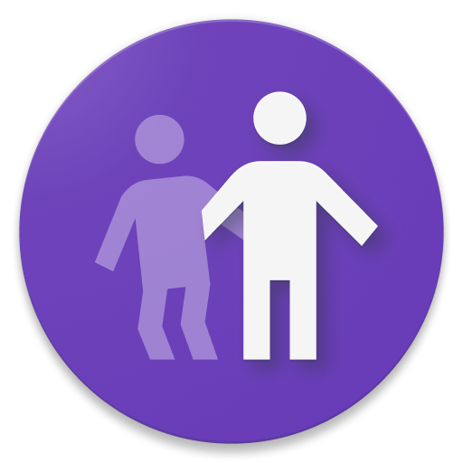

# EldersConnect Junior

EldersConnect is a smartphone app for iOS and Android to connect Senior Citizens to their Junior Caretakers in order to keep track of medicines, health, etc.

This is the Junior Caretaker's app repository. It is developed by members of ACM and N.O.W. Mozilla Club at NMIMS MPSTME.

## Building

**Important:** this project contains certain files that are encrypted due to the use of API keys, which is why it will not build directly on your machine. Please refer to [ENCRYPTION.md](ENCRYPTION.md) for more information.

To build and run the app on your device, do the following:

-   Install Flutter by following the instructions on their [website](https://flutter.dev/docs/get-started/install/).
-   Clone this repo to your local machine using `git clone https://github.com/nowmozillaclub/eldersconnect-junior.git`.
-   Replace all the encrypted files with your own as explained in [ENCRYPTION.md](ENCRYPTION.md).
-   Connect your devices/emulators and run the app using `flutter run` in the root of the project directory.

**Note:** you can also run it in release mode using `flutter run --release` to improve performance and stability, however, debugging features will be disabled.

## Contributing

Please read the [CONTRIBUTING.md](CONTRIBUTING.md) file for more details on how to contribute.

## Credits

This project is primarily developed by a bunch of engineering students at NMIMS MPSTME. Take a look at the entire list of [contributors](https://github.com/nowmozillaclub/eldersconnect-junior/graphs/contributors) to see who all have helped with the project via pull requests.

## License

This project is licensed under the MIT License - see the [LICENSE](LICENSE) file for details.
